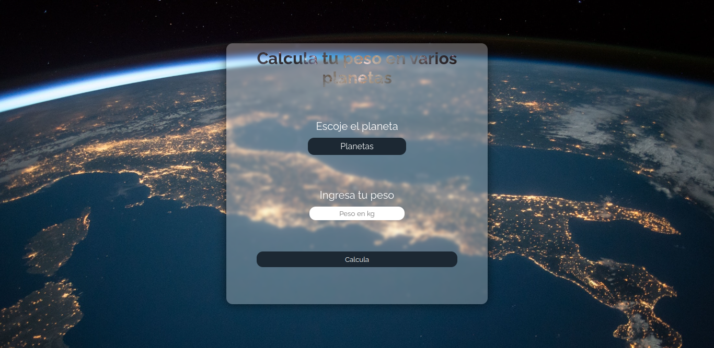
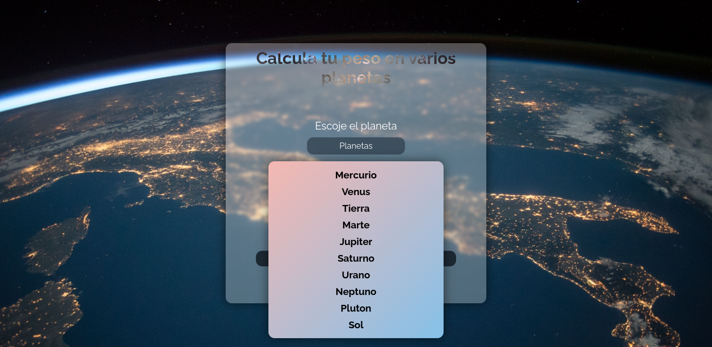
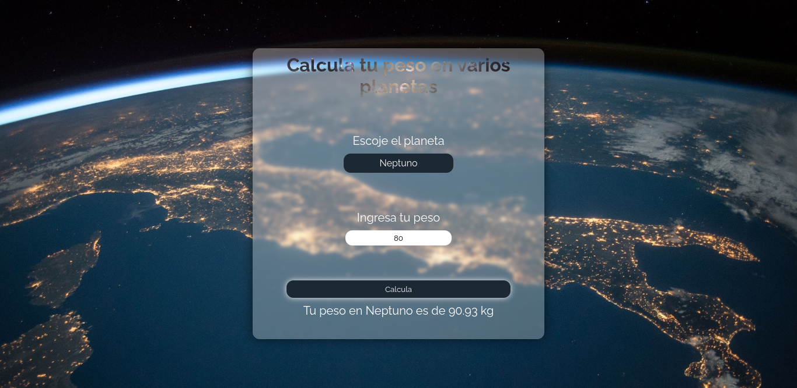

<h1 align="center">Weight calculation on other planets</h1>

Simple web page that given the selected weight and the selected planet will calculate its equivalent on that planet. In order to calculate the operations, a simple rule of three of the ( weight \* gravity ) / 9.81 is used.

:link: Weight-calculation-on-other-planets https://eddybel.github.io/Weight-calculation-on-other-planets/

# Preview Proyect

---

---

# Technologies

- JavaScript
- CSS
- HTML
